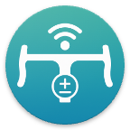

# OpenBikeControl Protocol Specification

## Overview

OpenBikeControl is an open protocol for wireless input devices to control cycling trainer applications. It enables standardized communication between BLE controllers, apps, and the training app itself.

### Motivation

Many cycling trainer apps support various actions that traditionally require:
- On-screen button clicks
- Keyboard input
- Proprietary BLE controllers

OpenBikeControl provides a unified, open protocol that:
- **Easy to implement** - Simple data format with minimal overhead
- **Open standard** - No licensing fees or proprietary restrictions
- **Dual connectivity** - Supports both BLE and network-based connections
- **Already partially adopted** - Similar technology as the existing "Direct Connect" implementations
- **Apple-friendly** - Does not rely on manufacturer data fields that cannot be emulated on iOS

Continue along at [PROTOCOL.md](PROTOCOL.md).

# Implementations

### BikeControl
The OpenBikeControl protocol is already implemented into the BikeControl app, allowing the control of supported trainer apps, using a good amount of different input devices:

[https://bikecontrol.app/](https://bikecontrol.app/)

Several trainer apps are either currently implementing the protocol, or have expressed interest in doing so. More details to follow.
