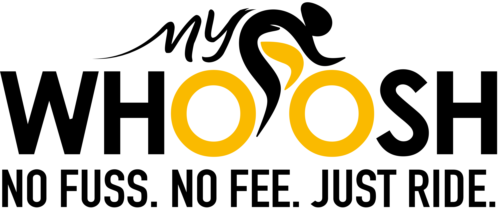
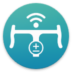

# OpenBikeControl Protocol Specification

## Overview

OpenBikeControl is an open protocol for wireless input devices to control cycling trainer applications. It enables standardized communication between BLE controllers, apps, and the training app itself.

### Motivation

Many cycling trainer apps support various actions that traditionally require:
- On-screen button clicks
- Keyboard input
- Proprietary BLE controllers

OpenBikeControl provides a unified, open protocol that:
- **Easy to implement** - Simple data format with minimal overhead
- **Open standard** - No licensing fees or proprietary restrictions
- **Dual connectivity** - Supports both BLE and network-based connections
- **Already partially adopted** - Similar technology as the existing "Direct Connect" implementations
- **Apple-friendly** - Does not rely on manufacturer data fields that cannot be emulated on iOS

Continue along at [PROTOCOL.md](PROTOCOL.md).

Smart trainer manufacturers: the optional [Virtual Shifting Extension](VIRTUAL_SHIFTING.md) describes how a trainer receives the simulated gear ratio from an app and reports the gear in use.

## Hardware
OpenBikeControl is now built into shipping hardware.

### Stages SB200
The [Stages SB200](https://stagescycling.com/en_us/stages-sb200-indoor-smart-bike) smart bike is the first hardware with OpenBikeControl built into its firmware. It connects over Bluetooth and Wi-Fi and exposes its shifters, brake levers and 10 customizable buttons through the protocol, with TrainingPeaks Virtual supporting it natively from launch day. Through BikeControl it is also compatible with most other trainer apps.

Read more in the announcement: [The Stages SB200 is the first hardware with OpenBikeControl built in](https://bikecontrol.app/blog/stages-sb200-openbikecontrol/).

## Trainer apps
These are the trainer apps that implement the OpenBikeControl protocol, or plan to, allowing users to control them using compatible BLE controllers or network-based input devices.

- **Implemented:** MyWhoosh, TrainingPeaks Virtual, Strappo
- **Planned:** Rouvy, icTrainer, Biketerra

### MyWhoosh

Status: **Implemented**

[https://mywhoosh.com/](https://mywhoosh.com/)

### Rouvy

Status: **Planned**

[https://rouvy.com/](https://rouvy.com/)

### TrainingPeaks

Status: **Implemented**

[https://www.trainingpeaks.com/](https://www.trainingpeaks.com/)

### icTrainer

Status: **Planned**

[https://ictrainer.de/](https://ictrainer.de/)

### Biketerra

Status: **Planned**

[https://biketerra.com/](https://biketerra.com/)

### Strappo

Status: **Implemented**

[https://getstrappo.com/](https://getstrappo.com/)

# Implementations

### BikeControl
The OpenBikeControl protocol is already implemented into the BikeControl app, allowing the control of supported trainer apps, using a good amount of different input devices:

[https://bikecontrol.app/](https://bikecontrol.app/)
